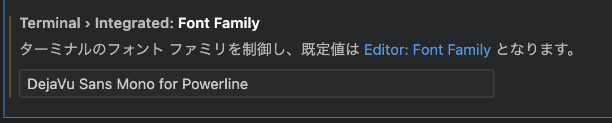

# mac　初期設定

## macの設定
ライブ変換無効
ドラッグロック
３本指でのアプリケーション切り替え有効
バッテリー%表示
メール設定
vivaldiインストール

iterm2インストール
CotEditorインストール

## Vscode
- vscodeインストール
https://code.visualstudio.com/docs/?dv=darwinarm64

## GitHub設定
- gitは初期インストール済だった。
- 鍵コピー
- configコピー

### ユーザ設定

```sh
git config --global user.name "ユーザー名"
git config --global user.email メールアドレス
```

.DS_Store をignoreする。

```sh
mkdir -p ~/.config/git
echo '.DS_Store' >> ~/.config/git/ignore
```


## Zsh設定
- git 設定

## brew インストール

https://brew.sh/index_ja

## aws cli v2インストール

```sh
curl "https://awscli.amazonaws.com/AWSCLIV2.pkg" -o "AWSCLIV2.pkg"
sudo installer -pkg AWSCLIV2.pkg -target /
```

```
installer: This package requires Rosetta 2 to be installed.
                Please install Rosetta 2 and then try again.
                    `sudo softwareupdate --install-rosetta`

installer: Error - AWS Command Line Interfaceはこのコンピュータにインストールできません。
```
→Rosetta2のインストールが必要。

### 代替
```sh
brew install awscli
```

```
aws     compgen:96: no such file or directory: /usr/local/bin/aws_completer
```
とコマンド補完が効かないので
`/opt/homebrew/Cellar/awscli/2.9.15/libexec/bin/aws_completer`に対してシンボリックリンクを貼る。

```sh
sudo ln -s /opt/homebrew/Cellar/awscli/2.12.1/libexec/bin/aws_completer /usr/local/bin/aws_completer
```
awscli配下のバージョンはインストールのタイミングで異なるので、確認してから実行すること
`/usr/local/bin/aws_completer`がすでに存在した場合は削除してから実行する。


#### アップグレードする場合

```sh
brew update
```

```sh
brew upgrade awscli
```

- 再度シンボリックリンク作成
```sh
sudo rm -f /usr/local/bin/aws_completer
sudo ln -s /opt/homebrew/Cellar/awscli/2.11.20/libexec/bin/aws_completer /usr/local/bin/aws_completer
```


## awsp インストール

```sh
npm install -g awsp
```
zsh: command not found: npm
npmがインストールされていない。

### npmインストール

参考記事:https://qiita.com/shinobear01/items/440c5f89c10a35f916b3

- nodebrew Install
```sh
brew install nodebrew
```

- Version確認
```sh
nodebrew -v
```

- 最新Node.jsインストール
```sh
mkdir -p ~/.nodebrew/src
```

```sh
nodebrew install-binary latest
```

- Version確認
```sh
nodebrew use latest
npm -v
```


## pecoインストール

```sh
brew install peco
```


## Authyインストール
AppStoreからインストール


## Slackインストール
AppStoreからインストール

## Terraformインストール

- tfenv インストール
```sh
brew install tfenv
```

- Arm版の最新をインストール
```sh
TFENV_ARCH=arm64 tfenv install latest
```

```
〉terraform -v
cat: /opt/homebrew/Cellar/tfenv/3.0.0/version: No such file or directory
Version could not be resolved (set by /opt/homebrew/Cellar/tfenv/3.0.0/version or tfenv use <version>)
```
→エラー

- Version利用指定
```sh
tfenv use latest
```
Switching default version to v1.3.7
Default version (when not overridden by .terraform-version or TFENV_TERRAFORM_VERSION) is now: 1.3.7

- Version確認
```sh
terraform -v
```
There are some problems with the CLI configuration:
╷
│ Error: The specified plugin cache dir /Users/yuumabashi/.terraform.d/plugin-cache cannot be opened: stat /Users/yuumabashi/.terraform.d/plugin-cache: no such file or directory
│
╵

As a result of the above problems, Terraform may not behave as intended.


- Directory作成
```sh
mkdir ~/.terraform.d/plugin-cache
```

- Version確認
```sh
terraform -v
```
Terraform v1.3.7
on darwin_arm64
→ `darwin_arm64`になっていることを確認。


### aws-vaultインストール

```sh
brew install --cask aws-vault
```

一定期間経過するとパスワードをきかれてしまうためようになるため
キーチェーンのタイムアウトを伸ばす。
https://qiita.com/minamijoyo/items/5ed3113434e51308ded1

```sh
open ~/Library/Keychains/aws-vault.keychain-db
```
左のペインで`aws-vault`を右クリックし、
操作しない状態が〜、とスリープ時にロックのチェックを外す。


## Terraform-docs

```sh
brew install terraform-docs
```

## /usr/local/bin設定


## aws alias設定

```sh
cp -p aws/cli/alias ~/.aws/cli/
```

## Finchインストール

https://github.com/runfinch/finch

- 初回起動
```sh
finch vm init
```

- 起動する場合　※1 init直後は起動している。
```sh
finch vm start
```

```sh
finch run --rm public.ecr.aws/finch/hello-finch
```

## Docker For Macインストール

https://docs.docker.com/desktop/install/mac-install/


## Goインストール

```sh
brew install go
```


---
## zsh プロンプト設定

```sh
brew install romkatv/powerlevel10k/powerlevel10k
echo "source $(brew --prefix)/opt/powerlevel10k/powerlevel10k.zsh-theme" >>~/.zshrc
```

- 特殊フォントインストール
```sh
cd ~/
git clone https://github.com/powerline/fonts
 cd fonts
 ./install.sh
```

ターミナルの設定画面でフォントを「DejaVu Sans Mono Powerline」に変更します。

このままではVscodeのterminalの文字コードが表示されないので
Vscodeの設定も変更します。

Vscodeの設定で以下を追加
```json
{
    [...]
    "terminal.integrated.fontFamily": "DejaVu Sans Mono for Powerline",
    [...]   
}
```



## infracost

```sh
brew install infracost
```
